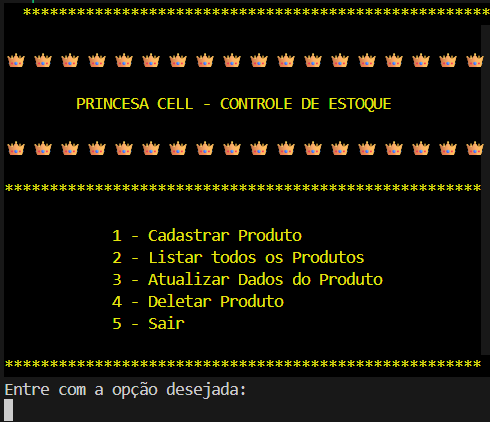
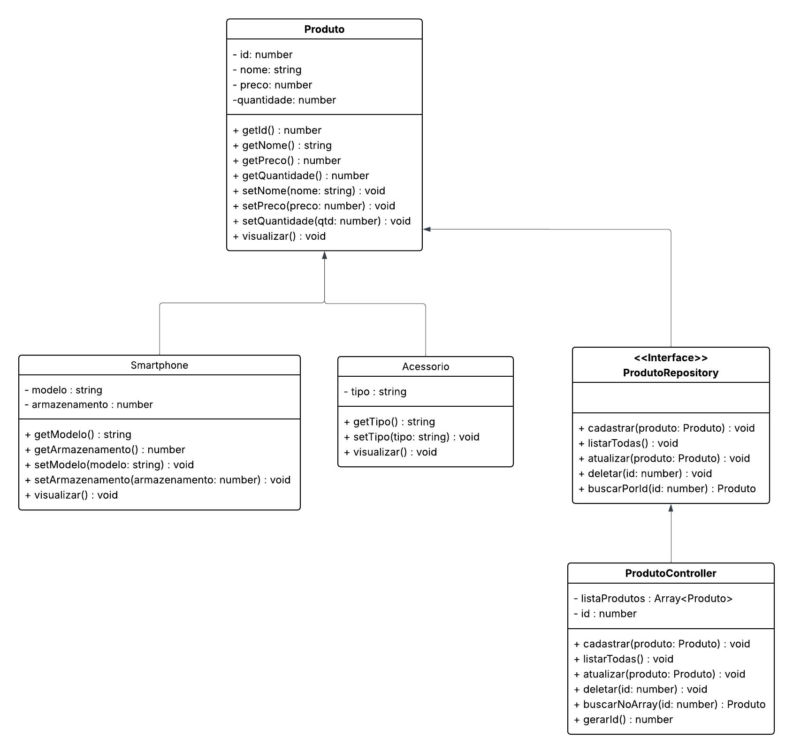

 

<h1 align="center"> 📦 Sistema de Controle de Estoque: e-commerce 📦</h1>

###

Projeto desenvolvido em TypeScript, com execução via Node.js, como parte das atividades práticas da Generation Brasil, com foco na aplicação dos conceitos de Programação Orientada a Objetos (POO) e organização em camadas. O sistema simula o controle de estoque de um e-commerce, permitindo o gerenciamento de diferentes tipos de produtos por meio de um menu interativo no terminal.

###
 

 

  <h2>Interface do Sistema (Terminal)</h2>

  

    A imagem abaixo apresenta a execução real do sistema no terminal, exibindo o menu principal e as opções disponíveis para interação com o usuário:
  

  

  
  

 

  
<em>O sistema utiliza a biblioteca <code>readline-sync</code> para entrada de dados via terminal.</em>

  

  <h2>Funcionalidades</h2>

  <ul>
    <li>• Cadastrar produtos no estoque</li>
    <li>• Listar todos os produtos cadastrados</li>
    <li>• Atualizar dados de um produto existente</li>
    <li>• Deletar produtos pelo ID</li>
    <li>• Gerenciamento de múltiplos tipos de produtos (Smartphone e Acessório)</li>
  </ul>

  

  <h2>Conceitos de Programação Aplicados</h2>

  <h3>🔹 Programação Orientada a Objetos (POO)</h3>

  <ul>
    <li><strong>Abstração</strong>: a classe abstrata <code>Produto</code> centraliza atributos e métodos comuns a todos os produtos do sistema.</li>
    <li><strong>Herança</strong>: as classes <code>Smartphone</code> e <code>Acessorio</code> herdam de <code>Produto</code>, especializando seus atributos conforme o tipo de produto.</li>
    <li><strong>Encapsulamento</strong>: os atributos são protegidos e acessados exclusivamente por meio de métodos getters e setters.</li>
    <li><strong>Polimorfismo</strong>: o método <code>visualizar()</code> é sobrescrito nas classes filhas, permitindo diferentes comportamentos a partir de uma mesma referência do tipo <code>Produto</code>.</li>
  </ul>

  <h3>🔹 Interface</h3>

  

    A interface <code>ProdutoRepository</code> define um contrato para as operações de CRUD (Create, Read, Update e Delete), promovendo padronização, desacoplamento e melhor organização do código.
  

  <h3>🔹 Controller</h3>

  

    A classe <code>ProdutoController</code> é responsável por gerenciar a coleção de produtos (<code>Array&lt;Produto&gt;</code>), concentrando as regras de negócio, como cadastro, atualização, exclusão e busca por ID.
  

  

  <h2>Diagrama UML</h2>

  

    O sistema foi modelado por meio de um <strong>Diagrama de Classes UML</strong>, evidenciando as relações de herança, interface e agregação entre os componentes do projeto.
  

  

  
   

  

  

  <h2>Tecnologias Utilizadas</h2>
  

###

  
  
  

###

  

    <em>
      Projeto desenvolvido com fins educacionais, no contexto da formação oferecida pela <strong>Generation Brasil</strong>, com foco na consolidação dos conceitos de POO, boas práticas de organização de código e desenvolvimento de aplicações em ambiente de terminal.
    </em>
  

</body>
</html>
